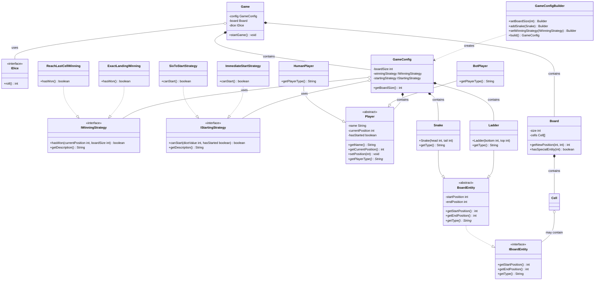
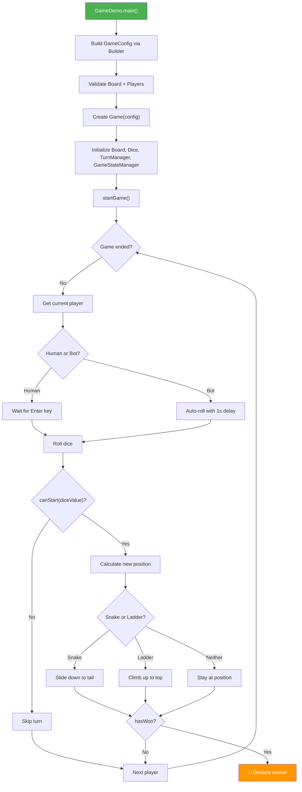

# 🎲 Snake & Ladder — Low-Level Design (LLD)

A production-grade Java implementation of the classic **Snake and Ladder** board game, built to demonstrate clean Low-Level Design principles, Gang-of-Four design patterns, and SOLID architecture. Every class is purpose-built, every dependency is injected through interfaces, and the entire game configuration is immutable by design.

> **24 Java source files · 5 Design Patterns · 4 Interfaces · 2 Abstract Classes · Full SOLID Compliance**

---

## Table of Contents

- [Architecture Overview](#architecture-overview)
- [Design Patterns](#design-patterns)
- [SOLID Principles](#solid-principles)
- [Project Structure](#project-structure)
- [Class Diagram](#class-diagram)
- [Component Deep-Dive](#component-deep-dive)
  - [Game Engine](#game-engine)
  - [Board & Entities](#board--entities)
  - [Player System](#player-system)
  - [Strategy Layer](#strategy-layer)
  - [Configuration & Validation](#configuration--validation)
- [Game Flow](#game-flow)
- [How to Run](#how-to-run)
- [Configuration Examples](#configuration-examples)
- [Key Design Decisions](#key-design-decisions)

---

## Architecture Overview

The system is organized into five cohesive layers, each with a single responsibility:

```
┌─────────────────────────────────────────────────────────────┐
│                      ENTRY POINT                            │
│                      GameDemo                               │
├─────────────────────────────────────────────────────────────┤
│                      GAME ENGINE                            │
│            Game  ·  TurnManager  ·  GameStateManager        │
├──────────────────────┬──────────────────────────────────────┤
│   BOARD LAYER        │          STRATEGY LAYER              │
│  Board · Cell        │  IWinningStrategy · IStartingStrategy│
│  Snake · Ladder      │  ExactLanding · ReachLastCell        │
│  BoardEntity         │  SixToStart  · ImmediateStart        │
├──────────────────────┴──────────────────────────────────────┤
│                   CONFIGURATION                             │
│         GameConfig (Builder) · BoardValidator               │
├─────────────────────────────────────────────────────────────┤
│                   PLAYER SYSTEM                             │
│       Player · HumanPlayer · BotPlayer · PlayerFactory      │
└─────────────────────────────────────────────────────────────┘
```

---

## Design Patterns

Five design patterns are applied across the codebase, each solving a distinct architectural concern:

| # | Pattern | Where Applied | Purpose |
|---|---------|---------------|---------|
| 1 | **Strategy** (×2 families) | `IWinningStrategy` → `ExactLandingWinning`, `ReachLastCellWinning`<br>`IStartingStrategy` → `SixToStartStrategy`, `ImmediateStartStrategy` | Encapsulate interchangeable game rules behind interfaces. Swap winning/starting logic at configuration time without modifying game engine code. |
| 2 | **Builder** | `GameConfig.Builder` | Construct complex, immutable `GameConfig` objects step-by-step with a fluent API. Private constructor on `GameConfig` forces all creation through the builder. |
| 3 | **Factory** | `PlayerFactory` | Centralize player creation with static factory methods. Handles ID generation, auto-naming for bots, and encapsulates the choice between `HumanPlayer` and `BotPlayer`. |
| 4 | **Template Method** (implicit) | `BoardEntity` → `Snake`, `Ladder`<br>`Player` → `HumanPlayer`, `BotPlayer` | Abstract classes define the skeleton (`getStartPosition`, `getEndPosition`, `getName`); subclasses override the variant step (`getType()`, `getPlayerType()`). |
| 5 | **Composition** | `Game` class | `Game` does not inherit behavior — it composes `Board`, `TurnManager`, `GameStateManager`, and `IDice` as collaborators, each owning a slice of the game logic. |

### Strategy Pattern — Winning Rules

```java
// Swap at configuration time — zero changes to Game.java
new GameConfig.Builder()
    .setWinningStrategy(new ExactLandingWinning())   // Must land exactly on cell 100
    // OR
    .setWinningStrategy(new ReachLastCellWinning())   // Reach or exceed cell 100
    .build();
```

### Strategy Pattern — Starting Rules

```java
new GameConfig.Builder()
    .setStartingStrategy(new SixToStartStrategy())     // Classic: roll 6 to begin
    // OR
    .setStartingStrategy(new ImmediateStartStrategy()) // Modern: start immediately
    .build();
```

### Builder Pattern — Immutable Configuration

```java
// Fluent API with private constructor + List.copyOf() defensive copying
GameConfig config = new GameConfig.Builder()
    .setBoardSize(100)
    .addSnake(new Snake(99, 54))
    .addLadder(new Ladder(2, 38))
    .addPlayer(PlayerFactory.createHumanPlayer("Alice"))
    .setWinningStrategy(new ExactLandingWinning())
    .setStartingStrategy(new SixToStartStrategy())
    .build();  // Validates on build, returns immutable object
```

---

## SOLID Principles

Every SOLID principle is actively demonstrated in this codebase:

| Principle | How It's Applied |
|-----------|-----------------|
| **S — Single Responsibility** | `Board` manages cell state. `TurnManager` handles turn rotation. `GameStateManager` processes moves. `BoardValidator` validates configuration. `Game` orchestrates — it doesn't calculate. |
| **O — Open/Closed** | New winning conditions or starting rules are added by creating a new class implementing `IWinningStrategy` or `IStartingStrategy`. No existing code is modified. |
| **L — Liskov Substitution** | `Snake` and `Ladder` are fully substitutable for `BoardEntity` / `IBoardEntity`. `HumanPlayer` and `BotPlayer` are substitutable for `Player`. The game engine never checks concrete types for logic decisions. |
| **I — Interface Segregation** | `IBoardEntity` (3 methods), `IDice` (1 method), `IWinningStrategy` (2 methods), `IStartingStrategy` (2 methods) — each interface is minimal and focused. No client is forced to depend on methods it doesn't use. |
| **D — Dependency Inversion** | `Game` depends on `IDice` (not `DiceImpl`). `GameConfig` depends on `IWinningStrategy` and `IStartingStrategy` (not concrete implementations). High-level modules never depend on low-level details. |

---

## Project Structure

```
Snake-Ladder-/
│
├── Game.java                    # Game engine — orchestrates the game loop
├── GameConfig.java              # Immutable config with nested Builder (private ctor)
├── GameDemo.java                # Entry point — demo with sample board setup
├── GameState.java               # Encapsulates mutable game state (positions, turns)
├── GameStateManager.java        # Processes moves, delegates to Board + WinningStrategy
├── TurnManager.java             # Round-robin turn management, winner declaration
│
├── Board.java                   # Board with 1-indexed Cell array + special entity map
├── Cell.java                    # Individual cell — may hold an IBoardEntity
├── BoardValidator.java          # Static validation: size bounds, positions, conflicts
│
├── IBoardEntity.java            # Interface: getStartPosition, getEndPosition, getType
├── BoardEntity.java             # Abstract: common start/end position fields
├── Snake.java                   # Concrete: head → tail (head > tail enforced)
├── Ladder.java                  # Concrete: bottom → top (bottom < top enforced)
│
├── Player.java                  # Abstract: name, id, position, hasStarted state
├── HumanPlayer.java             # Concrete: getPlayerType() → "HUMAN"
├── BotPlayer.java               # Concrete: getPlayerType() → "BOT"
├── PlayerFactory.java           # Static factory: createHumanPlayer / createBotPlayer
│
├── IDice.java                   # Interface: roll() → int
├── DiceImpl.java                # Concrete: Random-based, supports seeded testing
│
├── IWinningStrategy.java        # Interface: hasWon(position, boardSize)
├── ExactLandingWinning.java     # Win only when position == boardSize
├── ReachLastCellWinning.java    # Win when position >= boardSize
│
├── IStartingStrategy.java       # Interface: canStart(diceValue, hasStarted)
├── SixToStartStrategy.java      # Must roll 6 to enter the board
├── ImmediateStartStrategy.java  # Start with any roll
│
└── README.MD                    # This file
```

**File Metrics:** 24 Java files + 1 README &nbsp;|&nbsp; All concrete classes marked `final` &nbsp;|&nbsp; Zero circular dependencies

---

## Class Diagram



---

## Component Deep-Dive

### Game Engine

The engine is split into three collaborating classes, each with a single responsibility:

| Class | Responsibility | Key Methods |
|-------|---------------|-------------|
| `Game` | Orchestrates the game loop, handles user I/O, delegates to collaborators | `startGame()`, `gameLoop()`, `playTurn()` |
| `TurnManager` | Round-robin player rotation, winner tracking | `getCurrentPlayer()`, `nextTurn()`, `declareWinner()` |
| `GameStateManager` | Processes a move: computes new position via `Board`, checks win via `IWinningStrategy` | `makeMove(Player, int)` |
| `GameState` | Mutable state container: player list, current index, game-ended flag, winner reference | `moveToNextPlayer()`, `endGame(Player)` |

```java
// Game composes — never inherits
public final class Game {
    private final GameConfig config;
    private final Board board;
    private final IDice dice;
    private final TurnManager turnManager;
    private final GameStateManager stateManager;
}
```

### Board & Entities

The board is a **1-indexed** `Cell` array. Special entities (snakes/ladders) are stored in both the `Cell` and a `HashMap<Integer, IBoardEntity>` for O(1) lookup:

```java
// Board.getNewPosition — core movement logic
public int getNewPosition(int currentPosition, int diceValue) {
    int newPosition = currentPosition + diceValue;
    if (newPosition > size) return currentPosition;        // Stay if exceeding
    IBoardEntity entity = specialEntities.get(newPosition);
    if (entity != null) return entity.getEndPosition();    // Snake/Ladder effect
    return newPosition;
}
```

**Entity Hierarchy:**

```
IBoardEntity (interface)
  └── BoardEntity (abstract — holds startPosition, endPosition)
        ├── Snake (final — enforces head > tail in constructor)
        └── Ladder (final — enforces bottom < top in constructor)
```

Both `Snake` and `Ladder` perform **constructor validation** — it is impossible to create an invalid entity:

```java
public final class Snake extends BoardEntity {
    public Snake(int head, int tail) {
        super(head, tail);
        if (head <= tail) throw new IllegalArgumentException("Snake head must be greater than tail");
    }
}
```

### Player System

```
Player (abstract — name, id, position, hasStarted)
  ├── HumanPlayer (final — interactive, waits for Enter key)
  └── BotPlayer (final — automatic, 1-second delay)

PlayerFactory (static methods — centralized creation + auto-ID generation)
```

The `PlayerFactory` encapsulates creation logic and handles ID prefixing (`HUMAN_` / `BOT_`) and auto-naming:

```java
PlayerFactory.createHumanPlayer("Alice");  // → HumanPlayer("Alice", "HUMAN_Alice")
PlayerFactory.createBotPlayer("Bot1");     // → BotPlayer("Bot1", "BOT_Bot1")
PlayerFactory.createBotPlayer();           // → BotPlayer("Bot1", "BOT_Bot1") — auto-named
```

### Strategy Layer

Two independent strategy families allow mixing and matching of game rules:

**Winning Strategies (`IWinningStrategy`):**

| Implementation | Rule | Condition |
|----------------|------|-----------|
| `ExactLandingWinning` | Must land exactly on the last cell | `position == boardSize` |
| `ReachLastCellWinning` | Reach or exceed the last cell | `position >= boardSize` |

**Starting Strategies (`IStartingStrategy`):**

| Implementation | Rule | Condition |
|----------------|------|-----------|
| `SixToStartStrategy` | Must roll a 6 to enter the board | `hasStarted \|\| diceValue == 6` |
| `ImmediateStartStrategy` | Start moving on any roll | Always `true` |

Both strategy families can be extended with new implementations (e.g., `DoubleSixToStartStrategy`) without touching the game engine — a textbook application of the **Open/Closed Principle**.

### Configuration & Validation

`GameConfig` is built through its nested `Builder` class and is **immutable after construction**:

- **Private constructor** — only the `Builder` can instantiate
- **`List.copyOf()`** — defensive copying on all collections (snakes, ladders, players)
- **Validation on `build()`** — delegates to `BoardValidator` + internal `validatePlayers()`

`BoardValidator` performs four static validation passes:

| Validation | Rule |
|------------|------|
| Board size | Must be between 10 and 1000 |
| Snake positions | Head ∈ `[2, boardSize-1]`, tail ≥ 1 |
| Ladder positions | Bottom ∈ `[1, boardSize-1]`, top < boardSize |
| Conflict detection | No two entities may share the same start position |

---

## Game Flow



---

## How to Run

### Prerequisites

- **Java JDK 8+** (no external dependencies)

### Compile & Run

```bash
# Clone the repository
git clone https://github.com/<your-username>/Snake-Ladder-.git
cd Snake-Ladder-

# Compile all Java files
javac *.java

# Run the demo
java GameDemo
```

### Sample Output

```
=== Snake and Ladder Game Started ===
Board Size: 100
Winning Rule: Win by landing exactly on the last cell
Starting Rule: Must roll 6 to start the game
Players: 2
  - Alice (HUMAN)
  - Bot1 (BOT)

--- Alice's Turn ---
Current Position: 0
Press Enter to roll dice...
Dice rolled: 6
Moved from 0 to 6

--- Bot1's Turn ---
Current Position: 0
Bot is rolling dice...
Dice rolled: 3
Bot1 cannot start yet. Need to roll 6!

...

🎉 Game Over! Winner: Alice
```

---

## Configuration Examples

### Classic Mode — Roll 6 to Start, Exact Landing to Win

```java
GameConfig config = new GameConfig.Builder()
    .setBoardSize(100)
    .addSnake(new Snake(99, 54))
    .addSnake(new Snake(62, 19))
    .addLadder(new Ladder(2, 38))
    .addLadder(new Ladder(28, 84))
    .setWinningStrategy(new ExactLandingWinning())
    .setStartingStrategy(new SixToStartStrategy())
    .addPlayer(PlayerFactory.createHumanPlayer("Alice"))
    .addPlayer(PlayerFactory.createBotPlayer("Bot1"))
    .build();
```

### Casual Mode — Immediate Start, Reach/Exceed to Win

```java
GameConfig config = new GameConfig.Builder()
    .setBoardSize(50)
    .addSnake(new Snake(48, 10))
    .addLadder(new Ladder(5, 25))
    .setWinningStrategy(new ReachLastCellWinning())
    .setStartingStrategy(new ImmediateStartStrategy())
    .addPlayer(PlayerFactory.createHumanPlayer("Alice"))
    .addPlayer(PlayerFactory.createHumanPlayer("Bob"))
    .build();
```

### Bot-Only Simulation

```java
GameConfig config = new GameConfig.Builder()
    .setBoardSize(100)
    .addSnake(new Snake(95, 75))
    .addLadder(new Ladder(7, 14))
    .setWinningStrategy(new ReachLastCellWinning())
    .setStartingStrategy(new ImmediateStartStrategy())
    .addPlayer(PlayerFactory.createBotPlayer())  // Auto-named "Bot1"
    .addPlayer(PlayerFactory.createBotPlayer())  // Auto-named "Bot2"
    .build();
```

---

## Key Design Decisions

| Decision | Rationale |
|----------|-----------|
| **All concrete classes are `final`** | Prevents fragile base-class inheritance. Extension happens through interfaces and composition, not subclassing. |
| **`GameConfig` has a private constructor** | Forces creation through the `Builder`, guaranteeing validation runs before any config is used. |
| **`List.copyOf()` in `GameConfig`** | Returns unmodifiable lists — callers cannot mutate the config's internal state after construction. |
| **`Collections.unmodifiableList()` in `GameState`** | Exposes player list without allowing external modification of the active game state. |
| **`BoardValidator` is a separate class** | Keeps validation logic out of `GameConfig`. Single Responsibility — the config *holds* data, the validator *checks* it. |
| **`GameState` vs `TurnManager` vs `GameStateManager`** | Three-way split: `GameState` is the data container, `TurnManager` handles turn rotation, `GameStateManager` handles move processing. No class does two things. |
| **`DiceImpl` accepts an optional seed** | Enables deterministic testing by injecting a seeded `Random`, while production code uses the default constructor. |
| **1-indexed `Cell` array** | Matches natural board numbering (cell 1 through 100). Index 0 is unused — avoids off-by-one confusion. |
| **Strategies are injected, not hard-coded** | `Game` never contains `if (exactLanding)` conditionals. Behavior is selected at configuration time and executed polymorphically. |
| **Configurable board size (10–1000)** | Supports small test boards and large custom boards, validated at build time. |

---

## Extensibility

Adding new behavior requires **zero modifications** to existing classes:

| Extension | Steps |
|-----------|-------|
| New winning rule (e.g., *"Win only if you land on 100 with a 6"*) | Create `SixToWinStrategy implements IWinningStrategy` → inject via builder |
| New starting rule (e.g., *"Roll doubles to start"*) | Create `DoublesToStartStrategy implements IStartingStrategy` → inject via builder |
| New board entity (e.g., *Power-up*) | Create `PowerUp extends BoardEntity` → add to `Board` entity map |
| New dice type (e.g., *Two dice*) | Create `DoubleDice implements IDice` → inject into `Game` |
| New player type (e.g., *AI with strategy*) | Create `AIPlayer extends Player` → add factory method to `PlayerFactory` |

---

<p align="center">
  <b>Built with ☕ Java · No Frameworks · No Dependencies · Pure OOP</b>
</p>
